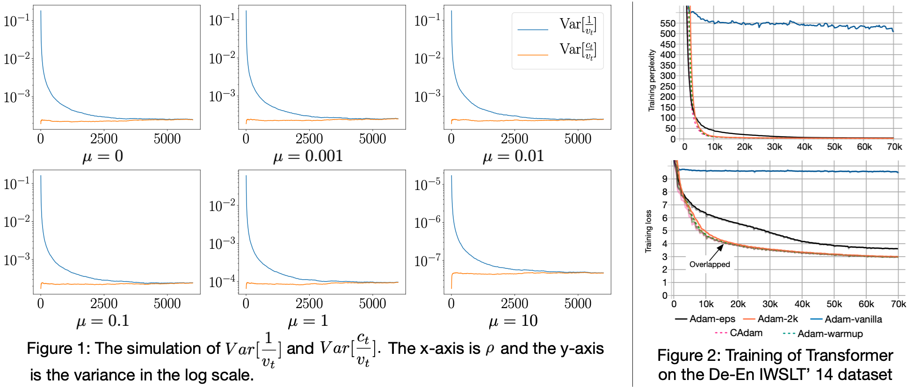

[](https://opensource.org/licenses/Apache-2.0)
[](https://travis-ci.org/LiyuanLucasLiu/RAdam)

<h1 align="center">RAdam</h1>
<h5 align="center">On the Variance of the Adaptive Learning Rate and Beyond</h5>

We are in an early-release beta. Expect some adventures and rough edges.

## Table of Contents

- [Introduction](#introduction)
- [Motivation](#motivation)
- [Questions and Discussions](#questions-and-discussions)
- [Quick Start Guide](#quick-start-guide)
- [Related Posts and Repos](#related-posts-and-repos)
- [Citation](#citation)

## Introduction
<h5 align="center"><i>If warmup is the answer, what is the question?</i></h5>

The learning rate warmup for Adam is a must-have trick for stable training in certain situations (or eps tuning). But the underlying mechanism is largely unknown. In our study, we suggest one fundamental cause is __the large variance of the adaptive learning rates__, and provide both theoretical and empirical support evidence.

In addition to explaining __why we should use warmup__, we also propose __RAdam__, a theoretically sound variant of Adam. 

## Motivation

As shown in Figure 1, we assume that gradients follow a normal distribution (mean: \mu, variance: 1). The variance of the adaptive learning rate is simulated and plotted in Figure 1 (blue curve). We observe that the adaptive learning rate has a large variance in the early stage of training.

<p align="center"></p>

When using a Transformer for NMT, a warmup stage is usually required to avoid convergence problems (e.g., Adam-vanilla converges around 500 PPL in Figure 2, while Adam-warmup successfully converges under 10 PPL).
In further explorations, we notice that, if we use additional 2000 samples to estimate the adaptive learning rate, the convergence problems are avoided (Adam-2k); or, if we increase the value of eps, the convergence problems are also relieved (Adam-eps).

Therefore, we conjecture that the large variance in the early stage causes the convergence problem, and further propose Rectified Adam by analytically reducing the large variance. More details can be found in our [paper](https://arxiv.org/abs/1908.03265).

## Questions and Discussions

### Do I need to tune learning rate?

Yes, the robustness of RAdam is not infinity. In our experiments, it works for a broader range of learning rates, but not all learning rates. 

### Notes on Transformer

__Choice of the Original Transformer__ 

We choose the original Transformer as our main study object because, without warmup, it suffers from the most serious convergence problems in our experiments. With such serious problems, our controlled experiments can better verify our hypothesis (i.e., we demonstrate that Adam-2k / Adam-eps can avoid spurious local optima by minimal changes).

__Sensitivity__ 

We observe that the Transformer is sensitive to the architecture configuration, despite its efficiency and effectiveness. For example, by changing the position of the layer norm, the model may / may not require the warmup to get a good performance. Intuitively, since the gradient of the attention layer could be more sparse and the adaptive learning rates for smaller gradients have a larger variance, they are more sensitive. Nevertheless, we believe this problem deserves more in-depth analysis and is beyond the scope of our study.

### Why does warmup have a bigger impact on some models than others?

Although the adaptive learning rate has a larger variance in the early stage, the exact magnitude is subject to the model design. Thus, the convergent problem could be more serious for some models/tasks than others. In our experiments, we observe that RAdam achieves consistent improvements over the vanilla Adam. It verifies the variance issue widely exists (since we can get better performance by fixing it). 

### What if the gradient is not zero-meaned?

As in Figure 1 (above), even if the gradient is not zero-meaned, the original adaptive learning rate still has a larger variance in the beginning, thus applying the rectification can help to stabilize the training.

Another related concern is that, when the mean of the gradient is significantly larger than its variance, the magnitude of the "problematic" variance may not be very large (i.e., in Figure 1, when \mu equals to 10, the adaptive learning rate variance is relatively small and may not cause problems). We think it provides a possible explaination on why warmup have a bigger impact on some models than others. Still, we suggest that, in real-world applications, neural networks usually have some parts of parameters meet our assumption well (i.e., their gradient variance is larger than their gradient mean), and needs the rectification to stabilize the training. 

### Why does SGD need warmup?

To the best of our knowledge, the warmup heuristic is originally designed for large minibatch SGD [0], based on the intuition that the network changes rapidly in the early stage. However, we find that it __does not__ explain why Adam requires warmup. Notice that, Adam-2k uses the same large learning rate but with a better estimation of the adaptive learning rate can also avoid the convergence problems.

The reason why sometimes warmup also helps SGD still lacks of theoretical support. FYI, when optimizing a simple 2-layer CNN with gradient descent, the thoery of [1] could be used to show the benifits of warmup. Specifically, the lr must be $O(cos \phi)$, where $\phi$ is the angle between the current weight and the ground true weight and $cos \phi$ could be very small due to  high dimensional space and random initialization. And thus lr must be very small at the beginning to guarentee the convergence. $cos \phi$ however can be improved in the later stage, and thus the learning rate is allowed to be larger. Their theory somehow can justify why warmup is needed by gradient descend and neural networks. But it is still far-fetched for the real scenario.

> <p>[0] Goyal et al, Accurate, Large Minibatch SGD: Training Imagenet in 1 Hour, 2017</p>
> [1] Du et al, Gradient Descent Learns One-hidden-layer CNN: Don’t be Afraid of Spurious Local Minima, 2017

## Quick Start Guide

1. Directly replace the vanilla Adam with RAdam without changing any settings. 
2. Further tune hyper-parameters (including the learning rate) for a better performance.

Note that in our paper, our major contribution is __to identify why we need the warmup for Adam__. Although some researchers successfully improve their model performance (__[user comments](#user-comments)__), considering the difficulty of training NNs, directly plugging in RAdam __may not__ result in an immediate performance boost. Based on our experience, replacing __the vanilla Adam__ with RAdam usually results in a better performance; however, if __warmup has already been employed and tuned__ in the baseline method, it is necessary to also tune hyper-parameters for RAdam. 

## Related Posts and Repos

### Unofficial Re-Implementations
RAdam is very easy to implement, we provide PyTorch implementations here, while third party ones can be found at:

[Keras Implementation](https://github.com/CyberZHG/keras-radam)

[Keras Implementation](https://github.com/titu1994/keras_rectified_adam)

### Unofficial Introduction & Mentions

We provide a simple introduction in [Motivation](#motivation), and more details can be found in our [paper](https://arxiv.org/abs/1908.03265). There are some unofficial introductions available (with better writings), and they are listed here for reference only (contents/claims in our paper are more accurate):

[Medium Post](https://medium.com/@lessw/new-state-of-the-art-ai-optimizer-rectified-adam-radam-5d854730807b)
> [related Twitter Post](https://twitter.com/jeremyphoward/status/1162118545095852032?ref_src=twsrc%5Etfw)

[CSDN Post (in Chinese)](https://blog.csdn.net/u014248127/article/details/99696029)

### User Comments

We are happy to see that our algorithms are found to be useful by some users : -)

<blockquote data-lang="en"><p lang="en" dir="ltr">&quot;...I tested it on ImageNette and quickly got new high accuracy scores for the 5 and 20 epoch 128px leaderboard scores, so I know it works... <a href=https://forums.fast.ai/t/meet-radam-imo-the-new-state-of-the-art-ai-optimizer/52656>https://forums.fast.ai/t/meet-radam-imo-the-new-state-of-the-art-ai-optimizer/52656</a></p>&mdash; Less Wright August 15, 2019</blockquote>

<blockquote data-conversation="none" data-lang="en"><p lang="en" dir="ltr">Thought &quot;sounds interesting, I&#39;ll give it a try&quot; - top 5 are vanilla Adam, bottom 4 (I only have access to 4 GPUs) are RAdam... so far looking pretty promising! <a href="https://t.co/irvJSeoVfx">pic.twitter.com/irvJSeoVfx</a></p>&mdash; Hamish Dickson (@_mishy) August 16, 2019</blockquote>

<blockquote data-conversation="none" data-lang="en"><p lang="en" dir="ltr">RAdam works great for me! It’s good to several % accuracy for free, but the biggest thing I like is the training stability. RAdam is way more stable! <a href="https://medium.com/@mgrankin/radam-works-great-for-me-344d37183943">https://medium.com/@mgrankin/radam-works-great-for-me-344d37183943</a></p>&mdash; Grankin Mikhail August 17, 2019</blockquote>

<blockquote data-lang="en"><p lang="en" dir="ltr">&quot;... Also, I achieved higher accuracy results using the newly proposed RAdam optimization function.... <a href=https://towardsdatascience.com/optimism-is-on-the-menu-a-recession-is-not-d87cce265b10>
https://towardsdatascience.com/optimism-is-on-the-menu-a-recession-is-not-d87cce265b10</a></p>&mdash; Sameer Ahuja August 24, 2019</blockquote>

<blockquote data-lang="en"><p lang="en" dir="ltr">&quot;... Out-of-box RAdam implementation performs better than Adam and finetuned SGD... <a href=https://twitter.com/ukrdailo/status/1166265186920980480>https://twitter.com/ukrdailo/status/1166265186920980480</a></p>&mdash; Alex Dailo August 27, 2019</blockquote>

## Citation
Please cite the following paper if you found our model useful. Thanks!

>Liyuan Liu, Haoming Jiang, Pengcheng He, Weizhu Chen, Xiaodong Liu, Jianfeng Gao, and Jiawei Han. "On the Variance of the Adaptive Learning Rate and Beyond." arXiv preprint arXiv:1908.03265 (2019).

```
@article{liu2019radam,
  title={On the Variance of the Adaptive Learning Rate and Beyond},
  author={Liu, Liyuan and Jiang, Haoming and He, Pengcheng and Chen, Weizhu and Liu, Xiaodong and Gao, Jianfeng and Han, Jiawei},
  journal={arXiv preprint arXiv:1908.03265},
  year={2019}
}
```
