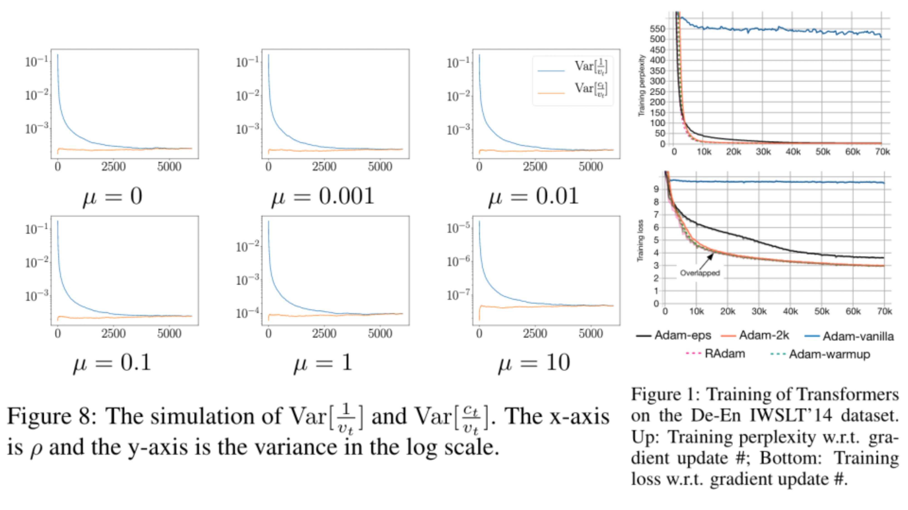

# RAdam

We are in an early-release beta. Expect some adventures and rough edges.

## What is the problem that we are interested in?

We want to uncover underlying principles of the warmup for Adam. In some applications, the warmup is a must-have to stabilize training, while its underlying mechanism is largely unknown. In our study, we suggest one root reason is __the large variance of the adaptive learning rate__, provide both theoretical and empirical evidence to support our hypothesis. 

### __TL;DR__ 
"If warmup is the answer, what is the question?", "Why we should use warmup and how?"

## Rectified Adam

As in Figure 8, we assume gradients subject to a normal distribution (mean: \mu, variance: 1). 
The variance of the adaptive learning rate is simulated and plotted in Figure 8 (blue line). We can see that the adaptive learning rate has a large variance in the early stage of training. 

At the same time, when using the Transformer for NMT (see more detailed discussions in the next section), a warmup stage is usually required to avoid convergence problems (Adam-vanilla converges around 500 PPL in Figure 1, while Adam-warmup successfully converges under 10 PPL). 
In further explorations, we notice that, if we use additional 2000 samples to update the adaptive learning rate, the convergence problems are avoided (Adam-2k); or, if we increase the value of eps, the convergence problems are relieved (Adam-eps). 

Therefore, we conjugate it is the large variance in the early stage causes the convergence problem, and further propose Rectified Adam by estimating the variance of the adaptive learning rate. More details can be found in our [paper](https://arxiv.org/abs/1908.03265).

## Questions and Discussions

### Why SGD needs warmup?

To the best of our knowledge, the warmup heuristic is originally designed for large minibatch sgd[0], and the intuition is to handle the large gradient variance in the early stage. In our study, we focus on optimizer instead of neural models; the variance of gradients deserves more in-depth analysis and is beyond the scope of our study. 

> [0] Priya Goyal, Piotr Dollar, Ross Girshick, Pieter Noordhuis, Lukasz Wesolowski, Aapo Kyrola, Andrew Tulloch, Yangqing Jia, and Kaiming He. Accurate, large minibatch sgd: Training imagenet
in 1 hour. arXiv preprint arXiv:1706.02677, 2017.

### Choice of Transformer

We choose the original Transformer as our study object because it suffers from more serious convergence problems. We show that, even for such setting, Adam-2k / Adam-eps can avoid convergence problems by minimal changes / controlled experiments, which verifies our hypothesis. 

### Why warmup has a bigger impact on some model, but not others?

Although the adaptive learning rate has a larger variance in the early stage, the exact magnitude is subject to the model design. Thus, the convergent problem could be more serious for some models/tasks than others. In our experiments, we observe RAdam achieves consistent improvements over the vanilla Adam. It verifies the variance issue widely exists (since we can get better performance by fixing it). 

### Notes on Transformer

We observe the Transformer to be sensitive, despite its efficiency and effectiveness. For example, by changing the position of the layer norm, the model may / may not require a warmup to get good performances. Intuitively, since the back-propagated gradient for the attention layer is more sparse, the adaptive learning rates for smaller gradients have a larger variance and is more sensitive. Still, we believe this problem deserves more in-depth analysis and is beyond the scope of our study. 

## Quick Start Guide

1. Directly replace the vanilla Adam with RAdam without changing any settings. 
2. Further tune hyper-parameters for a better performance.

Note that in our paper, our major contribution is __to identify why we need the warmup for Adam__. Although some users successfully improve the model performance (__[user comments](#user-comments)__), directly plugging in RAdam __may not__ result in an immediate performance boost. Based on our experience, replacing __the vanilla Adam__ with RAdam usually results in a better performance; however, if __warmup has already been employed and tuned__ in the baseline method, it is __necessary__ to tune hyper-parameters. 

## Related Posts and Repos

### Unofficial Re-Implementations
RAdam is very easy to implement, we provide PyTorch implementations here, while third party re-implementations can be found at:

[Keras Implementation](https://github.com/CyberZHG/keras-radam)

[Keras Implementation](https://github.com/titu1994/keras_rectified_adam)

### Unofficial Introduction & Mentions

We provide a simple introduction in [Rectified Adam](#rectified-adam), while more details can be found in our [paper](https://arxiv.org/abs/1908.03265). There are some unofficial introductions available(wrote by native English speakers), but they are listed here for reference only (contents/claims in our paper is more accurate):

[Medium Post](https://medium.com/@lessw/new-state-of-the-art-ai-optimizer-rectified-adam-radam-5d854730807b)

[Twitter Post](https://twitter.com/jeremyphoward/status/1162118545095852032?ref_src=twsrc%5Etfw)

### User Comments

We are happy to see that our algorithms are found to be useful by some users : -)

<blockquote data-lang="en">
&quot;...I tested it on ImageNette and quickly got new high accuracy scores for the 5 and 20 epoch 128px leaderboard scores, so I know it works... <a href=https://t.co/1MZmTbmFjn>https://t.co/1MZmTbmFjn</a>
&mdash; Less Wright August 15, 2019</blockquote>

<blockquote data-conversation="none" data-lang="en">
Thought &quot;sounds interesting, I&#39;ll give it a try&quot; - top 5 are vanilla Adam, bottom 4 (I only have access to 4 GPUs) are RAdam... so far looking pretty promising! <a href="https://t.co/irvJSeoVfx">pic.twitter.com/irvJSeoVfx</a>
&mdash; Hamish Dickson (@_mishy) August 16, 2019</blockquote>
